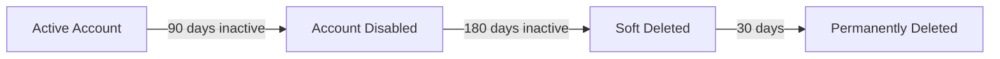

# Entra ID Inactive User Management

Azure Automation runbooks for identifying and managing inactive users in Microsoft Entra ID (Azure AD).

## Overview

This repository contains PowerShell runbooks that automate the lifecycle management of inactive user accounts:

| Runbook | Target | Action | Days |
|---------|--------|--------|------|
| `Entra-ID-Disable-Inactive-Member-Users-90-Days.ps1` | Members (enabled) | Disable | 90 |
| `Entra-ID-Delete-Inactive-Member-Users-180-Days.ps1` | Members (disabled) | Soft Delete | 180 |
| `Entra-ID-Delete-Inactive-Guest-Users-90-Days.ps1` | Guests | Soft Delete | 90 |
| `Entra-ID-Get-Inactive-Users-With-Manager-And-License.ps1` | Members with manager | Report + Group | 30 |

## Prerequisites

- Azure Automation account with PowerShell 7.x runtime
- System-assigned managed identity enabled
- Microsoft Graph PowerShell modules imported:
  - `Microsoft.Graph.Authentication`
  - `Microsoft.Graph.Users`
  - `Microsoft.Graph.Groups`
  - `Microsoft.Graph.Identity.DirectoryManagement`

## Quick Start

1. **Grant permissions** to your managed identity:
   ```powershell
   ./scripts/Grant-ManagedIdentityPermissions.ps1 -AutomationAccountName "your-automation-account"
   ```

2. **Import runbooks** into your Azure Automation account

3. **Configure parameters** and schedule as needed

See the [full documentation](https://lukeevanstech.github.io/col-entra-id/) for detailed setup instructions.

## Repository Structure

```
col-entra-id/
├── runbooks/               # Azure Automation runbooks
│   ├── Entra-ID-Disable-Inactive-Member-Users-90-Days.ps1
│   ├── Entra-ID-Delete-Inactive-Member-Users-180-Days.ps1
│   ├── Entra-ID-Delete-Inactive-Guest-Users-90-Days.ps1
│   └── Entra-ID-Get-Inactive-Users-With-Manager-And-License.ps1
├── scripts/                # Supporting utility scripts
│   └── Grant-ManagedIdentityPermissions.ps1
├── docs/                   # Documentation site (Zensical)
└── typst/                  # Handover document (auto-generated PDF)
```

## Documentation

Full documentation is available at: https://lukeevanstech.github.io/col-entra-id/

- [Setup Guide](https://lukeevanstech.github.io/col-entra-id/setup/) - Azure Automation configuration
- [Permissions](https://lukeevanstech.github.io/col-entra-id/permissions/) - Required Graph API permissions
- [Parameters](https://lukeevanstech.github.io/col-entra-id/parameters/) - Runbook parameter reference
- [Runbooks](https://lukeevanstech.github.io/col-entra-id/runbooks/) - Detailed runbook documentation
- [Handover Document (PDF)](typst/handover.pdf) - Printable handover document

## Safety Features

- **WhatIf mode** - All runbooks default to preview mode (no changes made)
- **Exclusion groups** - Skip users in specified security groups
- **Domain exclusions** - Skip users from specified domains
- **Department exclusions** - Skip users in specified departments
- **License filtering** - Only process users with specific licenses
- **Creation date check** - Skip recently created accounts
- **Soft delete** - Deleted users recoverable for 30 days

## User Lifecycle

### Member Users (Two-Stage)



### Guest Users (Single-Stage)


