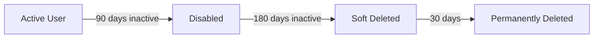

# Entra ID User Lifecycle Management

<div class="hero">
  <h1>Automated Inactive User Management</h1>
  <p>Azure Automation runbooks for identifying and managing inactive users in Microsoft Entra ID</p>
  <div class="buttons">
    <a href="#quick-start" class="button primary">Get Started</a>
    <a href="#runbooks" class="button">View Runbooks</a>
  </div>
</div>

---

## What is This?

**Entra ID User Lifecycle Management** provides Azure Automation runbooks that automate the lifecycle management of inactive user accounts in Microsoft Entra ID (Azure AD). The solution follows a two-stage approach for member users and a single-stage approach for guest users.

<div class="features">

<div class="feature">
<h3>🔄 Two-Stage Member Lifecycle</h3>
<p>Member users are first <strong>disabled</strong> after 90 days of inactivity, then <strong>deleted</strong> after 180 days.</p>
</div>

<div class="feature">
<h3>👥 Guest Cleanup</h3>
<p>Guest users are <strong>deleted</strong> after 90 days of inactivity to maintain a clean directory.</p>
</div>

<div class="feature">
<h3>🛡️ Flexible Exclusions</h3>
<p>Exclude users by <strong>security group</strong>, <strong>domain</strong>, <strong>department</strong>, or <strong>license type</strong>.</p>
</div>

<div class="feature">
<h3>✅ Safe by Default</h3>
<p>All runbooks default to <strong>WhatIf mode</strong> - preview changes before applying them.</p>
</div>

<div class="feature">
<h3>♻️ Soft Delete</h3>
<p>Deleted users are moved to the recycle bin and <strong>recoverable for 30 days</strong>.</p>
</div>

<div class="feature">
<h3>🔐 Managed Identity</h3>
<p>Uses Azure <strong>managed identity</strong> for secure, credential-free authentication to Microsoft Graph.</p>
</div>

</div>

---

## Runbooks

| Runbook | Target | Action | Days |
|---------|--------|--------|------|
| `Entra-ID-Disable-Inactive-Member-Users-90-Days.ps1` | Members (enabled) | Disable | 90 |
| `Entra-ID-Delete-Inactive-Member-Users-180-Days.ps1` | Members (disabled) | Soft Delete | 180 |
| `Entra-ID-Delete-Inactive-Guest-Users-90-Days.ps1` | Guests | Soft Delete | 90 |
| `Entra-ID-Get-Inactive-Users-With-Manager-And-License.ps1` | Members with manager | Report + Group | 30 |

### Member User Lifecycle



### Guest User Lifecycle


---

## Quick Start

### Prerequisites

- Azure Automation account with **PowerShell 7.x** runtime
- System-assigned **managed identity** enabled
- Microsoft Graph PowerShell modules:
    - `Microsoft.Graph.Authentication`
    - `Microsoft.Graph.Users`
    - `Microsoft.Graph.Groups`
    - `Microsoft.Graph.Identity.DirectoryManagement`

### Installation

1. **Grant permissions** to your managed identity:

    ```powershell
    ./scripts/Grant-ManagedIdentityPermissions.ps1 -AutomationAccountName "your-automation-account"
    ```

2. **Import runbooks** into your Azure Automation account

3. **Test with WhatIf mode** (enabled by default)

4. **Schedule runbooks** for regular execution

See the [Setup Guide](setup.md) for detailed instructions.

---

## Safety Features

- **WhatIf Mode** - All runbooks default to preview mode
- **Exclusion Groups** - Skip users in specified security groups
- **Domain Exclusions** - Skip users from specified domains
- **Department Exclusions** - Skip users in specified departments
- **License Filtering** - Only process users with specific licenses
- **Creation Date Check** - Skip recently created accounts
- **Soft Delete** - Deleted users recoverable for 30 days

---

## Repository Structure

```
col-entra-id/
├── runbooks/               # Azure Automation runbooks
│   ├── Entra-ID-Disable-Inactive-Member-Users-90-Days.ps1
│   ├── Entra-ID-Delete-Inactive-Member-Users-180-Days.ps1
│   ├── Entra-ID-Delete-Inactive-Guest-Users-90-Days.ps1
│   └── Entra-ID-Get-Inactive-Users-With-Manager-And-License.ps1
├── scripts/                # Supporting utility scripts
│   └── Grant-ManagedIdentityPermissions.ps1
└── docs/                   # Documentation (this site)
```

---

## Documentation

### Getting Started

- [Setup Guide](setup.md) - Azure Automation configuration
- [Permissions](permissions.md) - Required Graph API permissions

### Reference

- [Runbooks Overview](runbooks.md) - Detailed runbook documentation
- [Parameters](parameters.md) - Full parameter reference

---

## Default Exclusions

The runbooks are pre-configured with these exclusions:

| Exclusion Type | Values |
|----------------|--------|
| Domains | `cityoflondon.police.uk`, `freemens.org` |
| Departments | `Members` |
| Group | `Line Manager - Inactive User Review - Exclusion` |

---

## License

Private and proprietary to LukeEvansTech.

---

Made with Azure Automation and [Zensical](https://zensical.org/)
