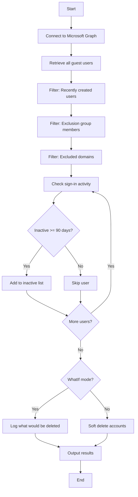

# Delete Inactive Guest Users (90 Days)



## Purpose

Identifies and soft deletes guest users who have been inactive for 90+ days. Guest users follow a simplified **single-stage** lifecycle compared to member users.

!!! info
    Guest runbooks do not filter by license or department as these typically don't apply to guest accounts.

## Target Users

| Criteria | Value |
|----------|-------|
| User Type | `Guest` |
| Account Status | Any (enabled or disabled) |

## Filtering Logic

1. Retrieve all guest users
2. Filter out users created within the last 90 days
3. Filter out users in the exclusion group (if specified)
4. Filter out users from excluded domains
5. Identify users with no sign-in activity for 90+ days

## Action

Soft deletes identified users via `Remove-MgUser`. Users are moved to the deleted items container and can be recovered for 30 days.

---

## Parameters

| Parameter | Type | Default | Description |
|-----------|------|---------|-------------|
| `InactiveDays` | int | `90` | Days without sign-in to consider inactive |
| `ExclusionGroupName` | string | `""` (empty) | Security group whose members are excluded |
| `ExclusionDomainList` | string[] | `@("cityoflondon.police.uk", "freemens.org")` | Domains to exclude |
| `DebugMode` | bool | `$false` | Enable verbose diagnostic logging |
| `WhatIf` | bool | `$false` | Preview mode - no changes made |

---

## Default Exclusions

| Type | Values |
|------|--------|
| Domains | `cityoflondon.police.uk`, `freemens.org` |

!!! note
    By default, no exclusion group is configured for guest users. Set `ExclusionGroupName` if you need to exclude specific guests.

---

## Examples

### Preview guest deletions (safe mode)

```powershell
.\Entra-ID-Delete-Inactive-Guest-Users-90-Days.ps1 -WhatIf $true
```

### Delete guests inactive for 90 days

```powershell
.\Entra-ID-Delete-Inactive-Guest-Users-90-Days.ps1 -WhatIf $false
```

### Use an exclusion group

```powershell
.\Entra-ID-Delete-Inactive-Guest-Users-90-Days.ps1 `
    -ExclusionGroupName "Guest Exclusion Group" `
    -WhatIf $false
```

### Exclude additional domain

```powershell
.\Entra-ID-Delete-Inactive-Guest-Users-90-Days.ps1 `
    -ExclusionDomainList @("cityoflondon.police.uk", "freemens.org", "partner.com")
```

### Enable debug logging

```powershell
.\Entra-ID-Delete-Inactive-Guest-Users-90-Days.ps1 -DebugMode $true -WhatIf $true
```

---

## Required Permissions

| Permission | Purpose |
|------------|---------|
| `User.Read.All` | Read user properties including sign-in activity |
| `User.ReadWrite.All` | Delete user accounts |
| `Group.Read.All` | Read exclusion group membership |
| `Directory.Read.All` | Read directory data |

---

## Soft Delete Recovery

Deleted guest users are moved to the Entra ID deleted items container and can be recovered for **30 days** after deletion.

To recover a deleted guest:

1. Navigate to **Entra ID** > **Users** > **Deleted users**
2. Select the guest user to recover
3. Click **Restore user**

Or via PowerShell:

```powershell
Restore-MgDirectoryDeletedItem -DirectoryObjectId <user-id>
```

---

## Sample Output

```
[2025-01-15 09:00:00] Starting Inactive Guest Users Deletion runbook (Azure Automation)
[2025-01-15 09:00:00] Inactive threshold: 90 days
[2025-01-15 09:00:00] WhatIf mode: True
[2025-01-15 09:00:01] Connected to Microsoft Graph. Tenant ID: xxx | Auth Type: ManagedIdentity
[2025-01-15 09:00:02] Retrieved 2000 guest users
[2025-01-15 09:00:02] Excluded 100 guest users created within the last 90 days
[2025-01-15 09:00:03] Found 350 inactive guest users (inactive >= 90 days)
[2025-01-15 09:00:03] WhatIf: Would delete guest user 'External Partner' (partner_contoso.com#EXT#@tenant.onmicrosoft.com)
...
[2025-01-15 09:00:10] Runbook execution complete
```
