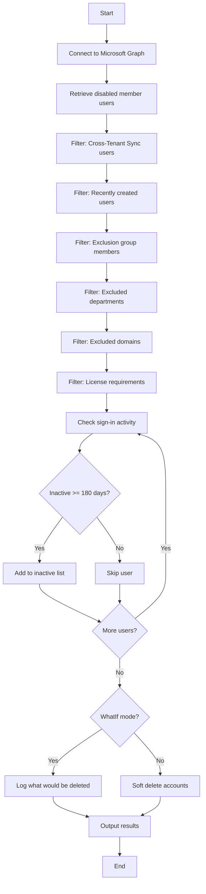

# Delete Inactive Member Users (180 Days)



## Purpose

Identifies and soft deletes disabled member users who have been inactive for 180+ days. This is the **second stage** of the member user lifecycle.

!!! note
    This runbook targets **disabled** member users (`accountEnabled eq false`) - users that were previously disabled by the [90-day disable runbook](runbook-disable-members.md).

## Target Users

| Criteria | Value |
|----------|-------|
| User Type | `Member` |
| Account Status | **Disabled** |
| Excludes | Cross-Tenant Sync users (UPN contains `#EXT#`) |

## Filtering Logic

1. Retrieve all **disabled** member users
2. Filter out users created within the last 180 days
3. Filter out users in the exclusion group
4. Filter out users in excluded departments
5. Filter out users from excluded domains
6. Filter to users with specified licenses
7. Identify users with no sign-in activity for 180+ days

## Action

Soft deletes identified users via `Remove-MgUser`. Users are moved to the deleted items container and can be recovered for 30 days.

---

## Parameters

| Parameter | Type | Default | Description |
|-----------|------|---------|-------------|
| `InactiveDays` | int | `180` | Days without sign-in to consider inactive |
| `ExclusionGroupName` | string | `Line Manager - Inactive User Review - Exclusion` | Security group whose members are excluded |
| `ExclusionDomainList` | string[] | `@("cityoflondon.police.uk", "freemens.org")` | Domains to exclude |
| `ExclusionDepartmentList` | string[] | `@("Members")` | Departments to exclude |
| `LicensesToInclude` | string[] | See below | License types to process |
| `DebugMode` | bool | `$false` | Enable verbose diagnostic logging |
| `WhatIf` | bool | `$true` | Preview mode - no changes made |

!!! warning
    Unlike the 90-day runbook, this runbook defaults to `WhatIf = $true` for extra safety since it performs deletions.

### Default License Include List

```powershell
$LicensesToInclude = @(
    "Microsoft 365 E5",
    "Microsoft 365 E3",
    "Microsoft 365 F1",
    "Microsoft 365 F5 Security Compliance",
    "Office 365 E5",
    "Office 365 E3",
    "Office 365 F1"
)
```

---

## Default Exclusions

Same as the [90-day disable runbook](runbook-disable-members.md#default-exclusions).

| Type | Values |
|------|--------|
| Group | `Line Manager - Inactive User Review - Exclusion` |
| Domains | `cityoflondon.police.uk`, `freemens.org` |
| Departments | `Members` |

---

## Examples

### Preview deletions (safe mode - default)

```powershell
.\Entra-ID-Delete-Inactive-Member-Users-180-Days.ps1
```

### Delete members inactive for 180 days

```powershell
.\Entra-ID-Delete-Inactive-Member-Users-180-Days.ps1 -WhatIf $false
```

### Enable debug logging

```powershell
.\Entra-ID-Delete-Inactive-Member-Users-180-Days.ps1 -DebugMode $true
```

---

## Required Permissions

| Permission | Purpose |
|------------|---------|
| `User.Read.All` | Read user properties including sign-in activity |
| `User.ReadWrite.All` | Delete user accounts |
| `Group.Read.All` | Read exclusion group membership |
| `Directory.Read.All` | Read directory data |
| `AuditLog.Read.All` | Access sign-in activity data |

---

## Soft Delete Recovery

Deleted users are moved to the Entra ID deleted items container and can be recovered for **30 days** after deletion. After 30 days, Microsoft permanently deletes the user.

To recover a deleted user:

1. Navigate to **Entra ID** > **Users** > **Deleted users**
2. Select the user to recover
3. Click **Restore user**

Or via PowerShell:

```powershell
Restore-MgDirectoryDeletedItem -DirectoryObjectId <user-id>
```

---

## Sample Output

```
[2025-01-15 09:00:00] Starting Inactive Member Users Deletion runbook (Azure Automation)
[2025-01-15 09:00:00] Inactive threshold: 180 days
[2025-01-15 09:00:00] WhatIf mode: True
[2025-01-15 09:00:01] Connected to Microsoft Graph. Tenant ID: xxx | Auth Type: ManagedIdentity
[2025-01-15 09:00:02] Retrieved 500 disabled member users
[2025-01-15 09:00:02] Excluded 10 users created within the last 180 days
[2025-01-15 09:00:03] Found 75 inactive disabled member users (inactive >= 180 days)
[2025-01-15 09:00:03] WhatIf: Would delete user 'Jane Smith' (jane.smith@contoso.com)
...
[2025-01-15 09:00:10] Runbook execution complete
```
