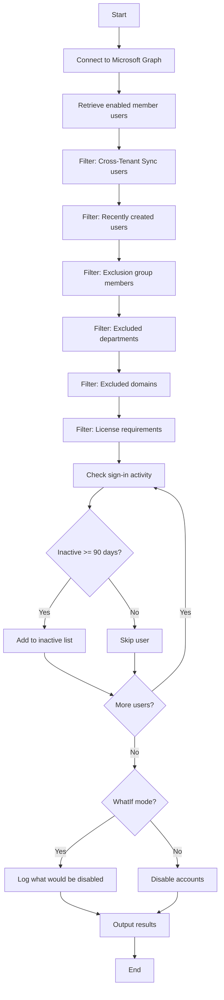

# Disable Inactive Member Users (90 Days)



## Purpose

Identifies and disables member users who have been inactive for 90+ days. This is the **first stage** of the member user lifecycle.

!!! info
    This runbook only targets **enabled** member users. Disabled users are handled by the [180-day deletion runbook](runbook-delete-members.md).

## Target Users

| Criteria | Value |
|----------|-------|
| User Type | `Member` |
| Account Status | Enabled |
| Excludes | Cross-Tenant Sync users (UPN contains `#EXT#`) |

## Filtering Logic

1. Retrieve all enabled member users
2. Filter out users created within the last 90 days
3. Filter out users in the exclusion group
4. Filter out users in excluded departments
5. Filter out users from excluded domains
6. Filter to users with specified licenses
7. Identify users with no sign-in activity for 90+ days

## Action

Sets `accountEnabled` to `$false` for identified users.

---

## Parameters

| Parameter | Type | Default | Description |
|-----------|------|---------|-------------|
| `InactiveDays` | int | `90` | Days without sign-in to consider inactive |
| `ExclusionGroupName` | string | `Line Manager - Inactive User Review - Exclusion` | Security group whose members are excluded |
| `ExclusionDomainList` | string[] | `@("cityoflondon.police.uk", "freemens.org")` | Domains to exclude |
| `ExclusionDepartmentList` | string[] | `@("Members")` | Departments to exclude |
| `LicensesToInclude` | string[] | See below | License types to process |
| `UserAction` | string | `Disable` | Action to take (`Disable` or `SoftDelete`) |
| `DebugMode` | bool | `$false` | Enable verbose diagnostic logging |
| `WhatIf` | bool | `$false` | Preview mode - no changes made |

### Default License Include List

```powershell
$LicensesToInclude = @(
    "Microsoft 365 E5",
    "Microsoft 365 E3",
    "Microsoft 365 F1",
    "Microsoft 365 F5 Security Compliance",
    "Office 365 E5",
    "Office 365 E3",
    "Office 365 F1"
)
```

---

## Default Exclusions

| Type | Values |
|------|--------|
| Group | `Line Manager - Inactive User Review - Exclusion` |
| Domains | `cityoflondon.police.uk`, `freemens.org` |
| Departments | `Members` |

---

## Examples

### Preview inactive members (safe mode)

```powershell
.\Entra-ID-Disable-Inactive-Member-Users-90-Days.ps1 -WhatIf $true
```

### Disable members inactive for 90 days

```powershell
.\Entra-ID-Disable-Inactive-Member-Users-90-Days.ps1 -WhatIf $false
```

### Exclude additional domain

```powershell
.\Entra-ID-Disable-Inactive-Member-Users-90-Days.ps1 `
    -ExclusionDomainList @("cityoflondon.police.uk", "freemens.org", "contractor.com")
```

### Process all licensed users (no license filter)

```powershell
.\Entra-ID-Disable-Inactive-Member-Users-90-Days.ps1 -LicensesToInclude @()
```

### Enable debug logging

```powershell
.\Entra-ID-Disable-Inactive-Member-Users-90-Days.ps1 -DebugMode $true -WhatIf $true
```

---

## Required Permissions

| Permission | Purpose |
|------------|---------|
| `User.Read.All` | Read user properties including sign-in activity |
| `User.ReadWrite.All` | Disable user accounts |
| `Group.Read.All` | Read exclusion group membership |
| `Directory.Read.All` | Read directory data |
| `AuditLog.Read.All` | Access sign-in activity data |

---

## Sample Output

```
[2025-01-15 09:00:00] Starting Inactive Member Users runbook (Azure Automation)
[2025-01-15 09:00:00] User action: Disable
[2025-01-15 09:00:00] WhatIf mode: True
[2025-01-15 09:00:01] Connected to Microsoft Graph. Tenant ID: xxx | Auth Type: ManagedIdentity
[2025-01-15 09:00:02] Retrieved 5000 active member users
[2025-01-15 09:00:02] Excluded 50 users created within the last 90 days
[2025-01-15 09:00:03] Excluded 25 users that are members of 'Line Manager - Inactive User Review - Exclusion'
[2025-01-15 09:00:03] Found 150 inactive member users (inactive >= 90 days)
[2025-01-15 09:00:03] WhatIf: Would disable user 'John Doe' (john.doe@contoso.com)
...
[2025-01-15 09:00:10] Runbook execution complete
```
