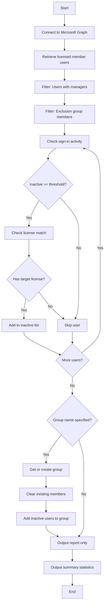

# Report Inactive Users with Manager



## Purpose

Identifies licensed member users with managers who have been inactive for a specified period (default 30 days). This is a **reporting runbook** that can optionally add identified users to a security group for line manager review.

!!! info
    This runbook identifies inactive users with managers and optionally adds them to a group for review. It does not disable or delete users. Set `InactiveUsersGroupName` to empty string to only report without group management.

## Target Users

| Criteria | Value |
|----------|-------|
| User Type | `Member` |
| Has Manager | Yes |
| Has License | Configurable (default: M365/O365 E1/E3/E5) |

## Filtering Logic

1. Retrieve all licensed member users with managers
2. Filter out users in the exclusion group
3. Filter to users with specified licenses
4. Identify users with no sign-in activity for the specified days

## Action

- Reports inactive users to Azure Automation logs
- Optionally adds users to a specified security group
- Creates the group if it doesn't exist
- Clears and refreshes group membership on each run

---

## Parameters

| Parameter | Type | Default | Description |
|-----------|------|---------|-------------|
| `InactiveDays` | int | `30` | Days without sign-in to consider inactive |
| `LicensesToCheck` | string[] | See below | License types to check |
| `InactiveUsersGroupName` | string | `Line Manager - Inactive User Review` | Group to add inactive users to |
| `ExclusionGroupName` | string | `Line Manager - Inactive User Review - Exclusion` | Security group whose members are excluded |

### Default Licenses to Check

```powershell
$LicensesToCheck = @(
    "Microsoft 365 E5",
    "Microsoft 365 E3",
    "Office 365 E5",
    "Office 365 E3",
    "Office 365 E1"
)
```

---

## Examples

### Report inactive users with managers (default 30 days)

```powershell
.\Entra-ID-Get-Inactive-Users-With-Manager-And-License.ps1
```

### Report only (no group management)

```powershell
.\Entra-ID-Get-Inactive-Users-With-Manager-And-License.ps1 -InactiveUsersGroupName ""
```

### Custom inactivity threshold

```powershell
.\Entra-ID-Get-Inactive-Users-With-Manager-And-License.ps1 -InactiveDays 60
```

### Check all licenses

```powershell
.\Entra-ID-Get-Inactive-Users-With-Manager-And-License.ps1 -LicensesToCheck @()
```

### Use custom group name

```powershell
.\Entra-ID-Get-Inactive-Users-With-Manager-And-License.ps1 `
    -InactiveUsersGroupName "HR - Inactive User Review"
```

---

## Required Permissions

| Permission | Purpose |
|------------|---------|
| `User.Read.All` | Read user properties including sign-in activity |
| `Group.Read.All` | Read group membership |
| `GroupMember.ReadWrite.All` | Add users to review groups |
| `Directory.Read.All` | Read directory data |

!!! note
    This runbook requires `GroupMember.ReadWrite.All` for adding users to the review group. Other runbooks don't need this permission.

---

## Group Management Behaviour

When `InactiveUsersGroupName` is specified:

1. **Group Lookup** - Searches for existing group by display name
2. **Auto-Create** - Creates the group if it doesn't exist
3. **Clear Members** - Removes all existing members from the group
4. **Add Inactive Users** - Adds all identified inactive users
5. **Refresh on Each Run** - Group membership represents current inactive users only

This ensures the group always reflects the **current** list of inactive users, not a cumulative list.

---

## Report Output

The runbook outputs detailed information for each inactive user:

- Display Name and UPN
- Department and Job Title
- Days since last sign-in
- Last sign-in date
- Manager details (name, UPN, department)
- Assigned licenses
- Account enabled status
- Created date

### Summary Statistics

- Total inactive users found
- Users who never signed in
- Disabled accounts count
- Unique departments affected
- Unique managers affected
- Top departments by inactive user count

---

## Sample Output

```
[2025-01-15 09:00:00] Starting Inactive Licensed Users with Manager Report (Azure Automation)
[2025-01-15 09:00:01] Connected to Microsoft Graph. Tenant ID: xxx
[2025-01-15 09:00:02] Retrieved 3000 licensed member users
[2025-01-15 09:00:03] Found 2500 licensed member users with managers
[2025-01-15 09:00:04] Excluded 50 users that are members of 'Line Manager - Inactive User Review - Exclusion'

=== INACTIVE LICENSED USERS WITH MANAGERS ===
Total inactive users found: 125
Inactive threshold: 30 days (since 2024-12-16)
License types checked: Microsoft 365 E5, Microsoft 365 E3, Office 365 E5, Office 365 E3, Office 365 E1

--- USER DETAILS ---
User: John Doe (john.doe@contoso.com)
  Department: IT
  Job Title: Developer
  Days Inactive: 45 days
  Last Sign-in: 2024-12-01 09:30:00
  Manager: Jane Smith (jane.smith@contoso.com)
  Manager Department: IT
  Licenses: Microsoft 365 E3
  Account Enabled: True
  ---

=== SUMMARY STATISTICS ===
Total inactive users: 125
Users who never signed in: 5
Disabled accounts: 10
Unique departments affected: 15
Unique managers affected: 45

--- GROUP MANAGEMENT SUMMARY ---
Target group: Line Manager - Inactive User Review (ID: xxx-xxx-xxx)
Users removed from group: 100
Users added to group: 125

--- TOP DEPARTMENTS BY INACTIVE USER COUNT ---
IT: 25 users
Finance: 20 users
HR: 15 users
```
