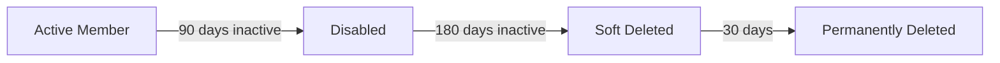

# Runbooks Overview

## User Lifecycle Strategy

This solution implements a two-stage lifecycle for member users and a single-stage lifecycle for guest users:

### Member Users



1. **Stage 1 - Disable (90 days)**: Active member users with no sign-in activity for 90 days are disabled
2. **Stage 2 - Delete (180 days)**: Disabled member users with no sign-in activity for 180 days are soft deleted

### Guest Users


1. **Single Stage - Delete (90 days)**: Guest users with no sign-in activity for 90 days are soft deleted

---

## Entra-ID-Disable-Inactive-Member-Users-90-Days.ps1

### Purpose

Identifies and disables member users who have been inactive for 90+ days. This is the first stage of the member user lifecycle.

### Target Users

- User type: `Member`
- Account status: `Enabled`
- Excludes Cross-Tenant Sync users (UPN contains `#EXT#`)

### Filtering Logic

1. Retrieve all enabled member users
2. Filter out users created within the last 90 days
3. Filter out users in the exclusion group
4. Filter out users in excluded departments
5. Filter out users from excluded domains
6. Filter to users with specified licenses
7. Identify users with no sign-in activity for 90+ days

### Action

Sets `accountEnabled` to `$false` for identified users.

### Default Exclusions

| Type | Values |
|------|--------|
| Group | `Line Manager - Inactive User Review - Exclusion` |
| Domains | `cityoflondon.police.uk`, `freemens.org` |
| Departments | `Members` |

---

## Entra-ID-Delete-Inactive-Member-Users-180-Days.ps1

### Purpose

Identifies and soft deletes disabled member users who have been inactive for 180+ days. This is the second stage of the member user lifecycle.

### Target Users

- User type: `Member`
- Account status: **Disabled** (`accountEnabled eq false`)
- Excludes Cross-Tenant Sync users (UPN contains `#EXT#`)

### Filtering Logic

1. Retrieve all **disabled** member users
2. Filter out users created within the last 180 days
3. Filter out users in the exclusion group
4. Filter out users in excluded departments
5. Filter out users from excluded domains
6. Filter to users with specified licenses
7. Identify users with no sign-in activity for 180+ days

### Action

Soft deletes identified users via `Remove-MgUser`. Users are moved to the deleted items container and can be recovered for 30 days.

### Default Exclusions

Same as the 90-day disable runbook.

---

## Entra-ID-Delete-Inactive-Guest-Users-90-Days.ps1

### Purpose

Identifies and soft deletes guest users who have been inactive for 90+ days.

### Target Users

- User type: `Guest`
- Any account status (enabled or disabled)

### Filtering Logic

1. Retrieve all guest users
2. Filter out users created within the last 90 days
3. Filter out users in the exclusion group (if specified)
4. Filter out users from excluded domains
5. Identify users with no sign-in activity for 90+ days

### Action

Soft deletes identified users via `Remove-MgUser`. Users are moved to the deleted items container and can be recovered for 30 days.

### Default Exclusions

| Type | Values |
|------|--------|
| Domains | `cityoflondon.police.uk`, `freemens.org` |

!!! info
    Guest runbooks do not filter by license or department as these typically don't apply to guest accounts.

---

## Sign-In Activity Detection

All runbooks use Microsoft Graph's `signInActivity` property to determine the last sign-in date. The following properties are checked (most recent wins):

1. `LastSignInDateTime` - Interactive sign-ins
2. `LastNonInteractiveSignInDateTime` - Background/app sign-ins
3. `LastSuccessfulSignInDateTime` - Last successful authentication

If no sign-in activity is recorded, the user is considered inactive.

---

## Output

Each runbook produces:

1. **Summary logs** - Count of users processed, filtered, and actioned
2. **User list** - Full list of inactive users output to the job stream
3. **Sample output** - First 10 users displayed in logs for quick review

### Sample Log Output

```
[2025-01-15 09:00:00] Starting Inactive Member Users runbook (Azure Automation)
[2025-01-15 09:00:00] User action: Disable
[2025-01-15 09:00:00] WhatIf mode: True
[2025-01-15 09:00:01] Connected to Microsoft Graph. Tenant ID: xxx | Auth Type: ManagedIdentity
[2025-01-15 09:00:02] Retrieved 5000 active member users
[2025-01-15 09:00:02] Excluded 50 users created within the last 90 days
[2025-01-15 09:00:03] Excluded 25 users that are members of 'Line Manager - Inactive User Review - Exclusion'
[2025-01-15 09:00:03] Found 150 inactive member users (inactive >= 90 days)
[2025-01-15 09:00:03] WhatIf: Would disable user 'John Doe' (john.doe@contoso.com)
...
[2025-01-15 09:00:10] Runbook execution complete
```

---

## Error Handling

- **Connection failures**: Runbook terminates with clear error message
- **Individual user failures**: Logged and counted, processing continues
- **Permission errors**: Detailed error message with remediation steps

All errors are captured in the Azure Automation job logs.
