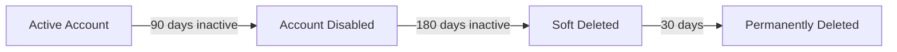
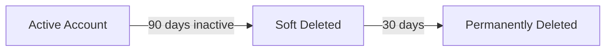

# Runbooks Overview

## User Lifecycle Strategy

This solution implements a two-stage lifecycle for member users and a single-stage lifecycle for guest users:

### Member Users

1. **Stage 1 - Disable (90 days)**: Active member users with no sign-in activity for 90 days are disabled
2. **Stage 2 - Delete (180 days)**: Disabled member users with no sign-in activity for 180 days are soft deleted

### Guest Users

1. **Single Stage - Delete (90 days)**: Guest users with no sign-in activity for 90 days are soft deleted

---

## Runbook Summary

| Runbook | Target | Action | Days | Details |
|---------|--------|--------|------|---------|
| Disable Inactive Member Users | Members (enabled) | Disable | 90 | [View Details](runbook-disable-members.md) |
| Delete Inactive Member Users | Members (disabled) | Soft Delete | 180 | [View Details](runbook-delete-members.md) |
| Delete Inactive Guest Users | Guests | Soft Delete | 90 | [View Details](runbook-delete-guests.md) |
| Report Inactive Users | Members with manager | Report + Group | 30 | [View Details](runbook-report-inactive.md) |

---

## Runbook Details

### [Disable Inactive Member Users (90 Days)](runbook-disable-members.md)

Identifies and disables member users who have been inactive for 90+ days. This is the first stage of the member user lifecycle.

- **Target**: Enabled member users
- **Action**: Sets `accountEnabled` to `$false`
- **Filters**: Exclusion group, domains, departments, licenses

### [Delete Inactive Member Users (180 Days)](runbook-delete-members.md)

Identifies and soft deletes disabled member users who have been inactive for 180+ days. This is the second stage of the member user lifecycle.

- **Target**: Disabled member users (previously disabled by 90-day runbook)
- **Action**: Soft delete via `Remove-MgUser`
- **Recovery**: 30 days in deleted items

### [Delete Inactive Guest Users (90 Days)](runbook-delete-guests.md)

Identifies and soft deletes guest users who have been inactive for 90+ days.

- **Target**: All guest users (enabled or disabled)
- **Action**: Soft delete via `Remove-MgUser`
- **Simplified**: No license or department filtering

### [Report Inactive Users with Manager](runbook-report-inactive.md)

Identifies licensed member users with managers who have been inactive for a specified period (default 30 days). Optionally adds users to a security group for line manager review.

- **Target**: Licensed members with managers
- **Action**: Report only (no disable/delete)
- **Optional**: Add to review group

---

## Sign-In Activity Detection

All runbooks use Microsoft Graph's `signInActivity` property to determine the last sign-in date. The following properties are checked (most recent wins):

1. `LastSignInDateTime` - Interactive sign-ins
2. `LastNonInteractiveSignInDateTime` - Background/app sign-ins
3. `LastSuccessfulSignInDateTime` - Last successful authentication

If no sign-in activity is recorded, the user is considered inactive.

---

## Default Exclusions

All member runbooks are pre-configured with these exclusions:

| Type | Values |
|------|--------|
| Group | `Line Manager - Inactive User Review - Exclusion` |
| Domains | `cityoflondon.police.uk`, `freemens.org` |
| Departments | `Members` |

!!! info
    Guest runbooks only filter by domain, not by license or department.

---

## Safety Features

All runbooks include multiple safety mechanisms:

- **WhatIf Mode** - All runbooks support preview mode
- **Exclusion Groups** - Skip users in specified security groups
- **Domain Exclusions** - Skip users from specified domains
- **Department Exclusions** - Skip users in specified departments
- **License Filtering** - Only process users with specific licenses
- **Creation Date Check** - Skip recently created accounts
- **Soft Delete** - Deleted users recoverable for 30 days

---

## Output

Each runbook produces:

1. **Summary logs** - Count of users processed, filtered, and actioned
2. **User list** - Full list of inactive users output to the job stream
3. **Sample output** - First 10 users displayed in logs for quick review

---

## Error Handling

- **Connection failures**: Runbook terminates with clear error message
- **Individual user failures**: Logged and counted, processing continues
- **Permission errors**: Detailed error message with remediation steps

All errors are captured in the Azure Automation job logs.
