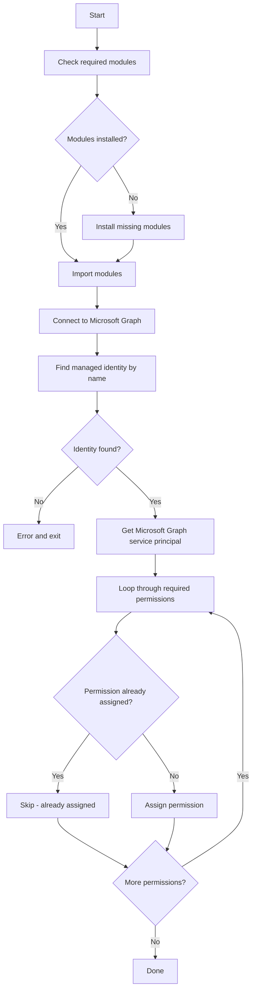

# Scripts Overview

## Purpose

This repository includes supporting utility scripts to help configure and manage the Azure Automation environment for the runbooks.

---

## Script Summary

| Script | Purpose | Requirements |
|--------|---------|--------------|
| Grant-ManagedIdentityPermissions.ps1 | Grant Microsoft Graph API permissions to managed identity | Global Admin or Privileged Role Administrator |

---

## Grant-ManagedIdentityPermissions.ps1



### Purpose

Grants the required Microsoft Graph API permissions to an Azure Automation account's system-assigned managed identity. This script must be run before the runbooks can function correctly.

### Parameters

| Parameter | Type | Required | Description |
|-----------|------|----------|-------------|
| `AutomationAccountName` | string | Yes | The name of the Azure Automation account |

### Permissions Granted

| Permission | Purpose |
|------------|---------|
| `User.Read.All` | Read all user properties including sign-in activity |
| `User.ReadWrite.All` | Disable and delete user accounts |
| `Directory.Read.All` | Read directory data |
| `Group.Read.All` | Read group membership for exclusions |

!!! note
    The reporting runbook also requires `GroupMember.ReadWrite.All` for adding users to review groups. You may need to add this permission manually if using that runbook.

### Requirements

- **PowerShell Modules**:
  - `Microsoft.Graph.Authentication`
  - `Microsoft.Graph.Applications`
- **Azure AD Role**: Global Admin or Privileged Role Administrator
- **Graph Scopes**: `Application.Read.All`, `AppRoleAssignment.ReadWrite.All`

### Usage

```powershell
.\Grant-ManagedIdentityPermissions.ps1 -AutomationAccountName "col-uks-mgmt-EntraID-aa"
```

### Example Output

```
Installing Microsoft.Graph.Authentication...
Installing Microsoft.Graph.Applications...
Found managed identity: 12345678-1234-1234-1234-123456789012
Granted 'User.Read.All'
Granted 'User.ReadWrite.All'
Granted 'Directory.Read.All'
Granted 'Group.Read.All'

Done. Permissions may take a few minutes to propagate.
```

### Idempotent Behaviour

The script is safe to run multiple times. If a permission is already assigned, it will be skipped with a warning message:

```
Permission 'User.Read.All' already assigned
```

---

## Verifying Permissions

After running the script, you can verify the permissions in the Azure Portal:

1. Navigate to **Entra ID** > **Enterprise applications**
2. Search for your Automation account name
3. Click on the managed identity
4. Go to **Permissions** under Security
5. Verify all required permissions are listed under "Admin consent"

Or via PowerShell:

```powershell
Connect-MgGraph -Scopes "Application.Read.All"
$mi = Get-MgServicePrincipal -Filter "displayName eq 'col-uks-mgmt-EntraID-aa'"
Get-MgServicePrincipalAppRoleAssignment -ServicePrincipalId $mi.Id |
    Select-Object AppRoleId, ResourceDisplayName
```

---

## Troubleshooting

### "Managed identity not found"

Ensure the Automation account has a **system-assigned managed identity** enabled:

1. Open your Automation account in Azure Portal
2. Go to **Identity** under Settings
3. Under **System assigned**, set Status to **On**
4. Click **Save**

### "Insufficient privileges"

You need one of the following roles:

- Global Administrator
- Privileged Role Administrator

### Permissions not taking effect

Microsoft Graph permissions can take 5-10 minutes to propagate. If runbooks still fail after granting permissions:

1. Wait 10 minutes
2. Try running the runbook again
3. Check the permissions in Enterprise Applications as described above
